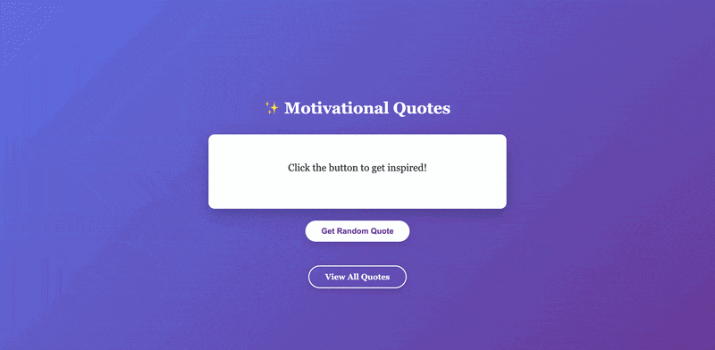

# Motivational Quotes API

A simple REST API built with **FastAPI** that serves random motivational quotes, with an interactive UI to browse and discover them.

**Live Demo:** [https://motivational-quotes.up.railway.app/](https://motivational-quotes.up.railway.app/)



## Features

- Get a random motivational quote with one click
- Browse all available quotes
- Interactive web UI served directly from FastAPI
- REST API endpoints for programmatic access

## Endpoints

| Method | Route     | Description                  |
|--------|-----------|------------------------------|
| GET    | `/`       | Interactive quotes UI        |
| GET    | `/quote`  | Get a random quote (JSON)    |
| GET    | `/quotes` | Get all available quotes (JSON) |

## Setup

```bash
pip install -r requirements.txt
python run.py
```

The server runs at `http://localhost:8000`.

Interactive API docs available at `http://localhost:8000/docs`.

## Deployment (Railway)

This app is deployed on [Railway](https://railway.app/).

The `Procfile` configures the start command:

```
web: uvicorn app.main:app --host 0.0.0.0 --port $PORT
```

To deploy your own instance:

1. Push the repo to GitHub
2. Connect the repo to a new Railway project
3. Railway auto-detects the `Procfile` and deploys

## Project Structure

```
motivational-quotes-api/
├── app/
│   ├── __init__.py
│   ├── main.py          # FastAPI app and routes
│   ├── quotes.py        # Quotes data and helper functions
│   ├── templates/
│   │   └── index.html   # Interactive UI
│   └── static/
│       └── style.css    # UI styling
├── run.py               # Entry point
├── requirements.txt
├── Procfile             # Railway start command
└── README.md
```

## Tech Stack

- Python
- FastAPI
- Uvicorn
- Jinja2
- Railway